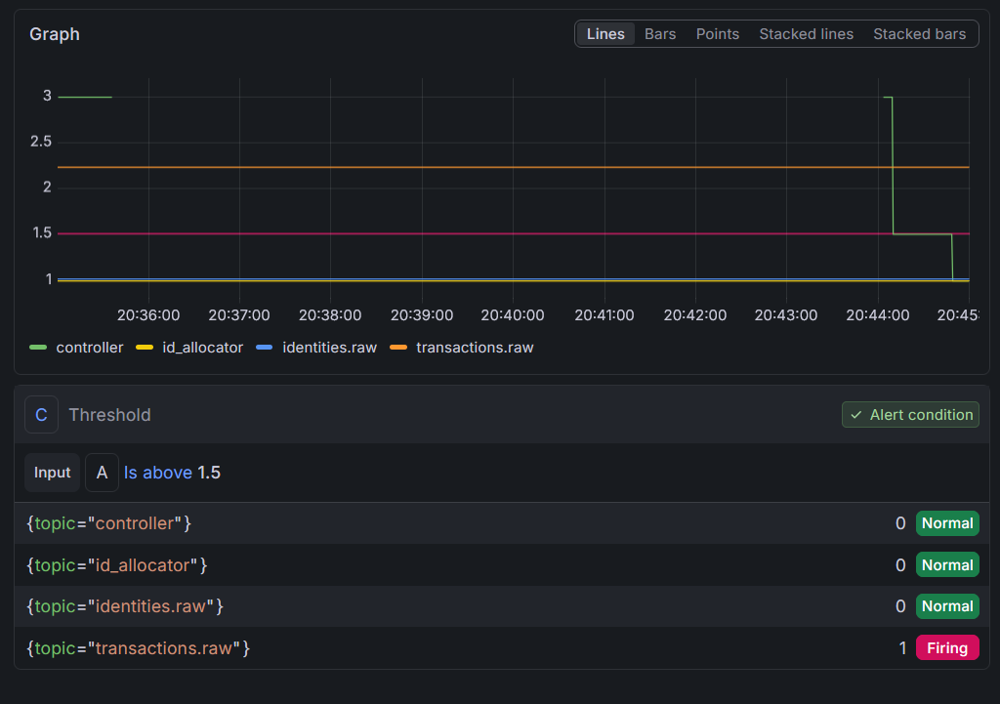
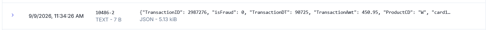
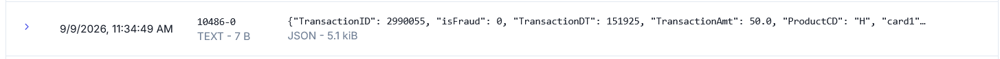

# Engineering Decisions, Trade-offs & Production Bottlenecks


This document highlights the core system-design challenges, failure modes, and architectural trade-offs resolved during the implementation of the project. Rather than focusing on surface-level framework syntax or basic pipeline setup, this section documents production-grade engineering decisions.

## Table of Contents
- [Engineering Decisions, Trade-offs \& Production Bottlenecks](#engineering-decisions-trade-offs--production-bottlenecks)
  - [Table of Contents](#table-of-contents)
  - [delay between two producers](#delay-between-two-producers)
  - [1. Hot Key Risk and Data Skew](#1-hot-key-risk-and-data-skew)
    - [What This Problem Is and Why It Matters](#what-this-problem-is-and-why-it-matters)
    - [When Does This Problem Happen?](#when-does-this-problem-happen)
      - [Hot Keys](#hot-keys)
      - [Key Grouping \& Hash Collisions](#key-grouping--hash-collisions)
    - [Our Solution](#our-solution)
      - [A. Partition Count](#a-partition-count)
      - [B. Detection — Partition-Level Monitoring](#b-detection--partition-level-monitoring)
      - [C. Semi-Automatic Flow](#c-semi-automatic-flow)
      - [D. Dedicated Partition](#d-dedicated-partition)
    - [Example Runs](#example-runs)

## delay between two producers
The separate two systems producer may make Small delays (5ms) fine, even good — mimics production reality, gives Flink job real join problem to solve.


## 1. Hot Key Risk and Data Skew

### What This Problem Is and Why It Matters

Hot key risk happens when a small number of partition-key values get much more traffic than the others. This pushes all events for that key into a single Kafka partition. Kafka's parallelism depends on partitions, so a hot key creates a hard limit on speed — no matter how big the cluster is. The affected partition falls behind while other partitions stay idle. This causes lag, delayed fraud scoring, and possible SLA problems.

In a payment platform, this risk is structural, not random. Transaction volume naturally centers around a small group of big merchants, issuers, and cardholders. The same keys that carry the most business value are also the most likely to overload a partition. If we don't manage this, fraud detection slows down exactly during the busiest and highest-risk times — for example, during a big merchant sale event, when fast and accurate detection matters most.

### When Does This Problem Happen?

#### Hot Keys

* **High-Volume Cardholders (Corporate & Bot Cards):** Using `card1` as the key means heavy cardholders — such as corporate fleet cards, payment bots, or card-testing attack scripts — generate rapid bursts that can overload a single partition.

#### Key Grouping & Hash Collisions

Partition skew can also happen without one single dominant hot key. Two main causes:

* **Low Cardinality Keys:** Fields with few possible values (like `country_code` or `payment_status`) push millions of transactions into a small set of partitions.
* **Hash Distribution Skew:** Kafka's `Murmur2` hash function (`Hash(Key) mod N`) can, by chance, map several different, medium-volume keys to the same partition. This creates a local hotspot, while other partitions stay empty.

### Our Solution

#### A. Partition Count

We chose a baseline partition count of 12 to mitigate **Hash Distribution Skew** (lowering the probability that Murmur2 maps multiple medium-volume keys into the same partition). Increasing partition count does not resolve a single dominant hot key, but it spreads baseline key entropy evenly across the cluster. Partition count will scale higher in production; 12 is our initial development baseline.

We chose `card1` as the partition key. Fraud detection needs events for each card to stay in order, and this ordering **requirement** removes every other key option. `card1` also has much **higher cardinality** than fields like `country_code`, which lowers — but does not remove — the structural hot-key risk from high-volume cardholders.

#### B. Detection — Partition-Level Monitoring

We monitor per-partition size using **Redpanda's native Prometheus metrics endpoint**, exposed directly on port `9644` (`vectorized_storage_log_partition_size`, labeled by `topic` and `partition`). This is Redpanda-specific: unlike traditional Apache Kafka, which requires a separate JMX-based `kafka_exporter` to get equivalent visibility, Redpanda exports Prometheus metrics natively — no exporter sidecar needed.

**Alert rule:**
```promql
max by (topic) (vectorized_storage_log_partition_size)
/
avg by (topic) (vectorized_storage_log_partition_size)
> 1.5
```
sustained for 5 minutes. This check works at the partition level, not the key level. It is cheap, runs all the time, and catches the problem no matter the cause (a dominant key or a hash collision).



#### C. Semi-Automatic Flow

We chose to confirm before salting, because a wrong salt has a real cost — it will break the order of an innocent key. `detect_hot_keys.py` supports two modes, both requiring interactive confirmation before any write to `hot_keys.json`.

**Sampling strategy.** Both modes sample by a *time window*, not a fixed message count. A fixed count (e.g. "last 50,000 messages") represents a different amount of wall-clock time depending on current traffic rate — a few minutes during a burst, potentially days during quiet traffic — which makes "is this key hot right now" inconsistent. Instead, both modes resolve a start offset via `offsets_for_times()` for `--lookback-minutes` minutes ago, giving a comparable window regardless of traffic rate. `--sample-size` is kept as an *upper cap*, not the primary control — it bounds how many messages a single run reads so a traffic spike inside the window can't make the scan run unbounded. Whichever limit is hit first stops the read.


**Mode 1 — `detect` (alert-triggered, single partition)**

```
python detect_hot_keys.py --mode detect --topic X --partition N \
  --lookback-minutes 10 --sample-size 50000
```

1. On-call runs the command above with the partition ID from the alert.
2. Script targets only that partition (`assign()`), seeks to the start of the lookback window (`offsets_for_times()`, capped by `--sample-size`).
3. Counts key share within the sampled window.
4. If no key crosses `HEAVY_THRESHOLD` (2%) → prints "no dominant key found — likely hash collision, not hot-key. See runbook." Exits, no write.
5. Compares found heavy keys against the current `hot_keys.json` — computes `added = heavy - old`.
6. If `added` is empty (all heavy keys already tracked) → prints "nothing to add." Exits, no write.
7. If `added` is non-empty → prints the list, prompts `Apply update? [y/N]`.
8. `y` → merges `added` into the existing set (union — never wipes other partitions' keys), writes the file.
9. Anything else → aborts, no write, decision logged.

**Mode 2 — `demote` (scheduled cron, topic-wide)**

```
python detect_hot_keys.py --mode demote --topic X \
  --lookback-minutes 60 --sample-size 50000
```

1. Runs on a schedule, independent of alerts.
2. If `hot_keys.json` is empty → exits immediately, nothing to demote.
3. Script discovers all partitions, seeks each to the start of the lookback window (cap split evenly per partition), samples the whole topic.
4. If no messages were sampled → exits, keeps `hot_keys.json` unchanged.
5. Every key is passed through `strip_salt()` before counting, so a salted key's traffic is recombined across all its buckets and partitions back into one share — required because a single-partition scan would see only `1/SALT_BUCKETS` of a still-hot key's real traffic.
6. For each key currently in `hot_keys.json`: if its summed share is now `< HEAVY_THRESHOLD` → candidate for removal.
7. If no keys cooled down → prints "no tracked hot keys have cooled down." Exits, no write.
8. Prints the candidate list, prompts `Remove these from hot_keys.json? [y/N]`.
9. `y` → removes and writes the file. Anything else → aborts, no write.


> [!NOTE] Note
> Salting intentionally breaks per-partition physical order for a hot key. Consumers must key-by the raw (unsalted) `card1` and use a bounded-out-of-orderness event-time window in Flink to reconstruct true per-card order before fraud sequence detection runs. The watermark bound is a latency/correctness tradeoff and should be sized from observed lag, not assumed.
> 
> If the script finds no key above threshold in a flagged partition, the heaviness is likely caused by Murmur2 hash collision among several medium-volume keys — not a single hot key. Salting will not help this case. Escalate for partition-count review instead.

> See the technical details and reload mechanism in [Semi-Automatic Hot Key Detection and Salting](03_producers.md#producer-side-hot-key-reload) for the producer-side implementation.


#### D. Dedicated Partition

If a hot key is persistent and structural (e.g., a massive corporate account), we isolate it to a dedicated partition using a custom static `Partitioner`. This isolates high-throughput traffic and preserves strict message ordering without resorting to salting.

Isolating a heavy key to a dedicated partition requires allocating sufficient consumer capacity (or a dedicated consumer thread) to handle that specific partition's write load without introducing lag.

> [!IMPORTANT] Decision Order Between the Three Solutions
> Partition count = the baseline, always active. Salting = the default reactive fix. Dedicated partition = only used when the same key stays hot across two or more scans (a chronic problem, not a short burst).

### Example Runs

**Detect mode — alert on partition 0, adds newly-found hot keys:**

```
$ docker compose --profile tools run --rm hot-key-scanner \
    python detect_hot_keys.py --mode detect --topic transactions.raw \
    --partition 0 --lookback-minutes 10 --sample-size 50000

2026-09-09 10:07:49,574 INFO scanning transactions.raw partition 0 (last 10 min, capped at 50000 msgs)...

partition 0: 12 heavy key(s) found (447 msgs sampled)
  10086: 2.0% of partition traffic  [NEW]
  10486: 2.5% of partition traffic  [already tracked]
  10960: 2.2% of partition traffic  [NEW]
  ...
  9350: 2.0% of partition traffic  [NEW]

Proposed addition: ['10086', '10960', '14649', '1556', '15757', '16630', '16709', '17966', '9002', '9350']
Apply this update to hot_keys.json? [y/N] y
2026-09-09 10:08:24,591 INFO hot_keys.json updated: 9 -> 19
```




**Demote mode — deliberately small sample size (500) to force a demotion for testing:**

```
$ docker compose --profile tools run --rm hot-key-scanner \
    python detect_hot_keys.py --mode demote --topic transactions.raw \
    --lookback-minutes 10 --sample-size 500

2026-09-09 10:11:57,922 INFO scanning transactions.raw topic-wide for demotion check (last 10 min, capped at 500 msgs)...
2026-09-09 10:12:27,990 INFO   10086: 0.20% of topic traffic (threshold 2%)
2026-09-09 10:12:27,991 INFO   10486: 0.61% of topic traffic (threshold 2%)
...
2026-09-09 10:12:27,994 INFO   9350: 0.81% of topic traffic (threshold 2%)

Candidates for removal (below 2% for this scan): ['10086', '10486', '10960', ...]
Remove these from hot_keys.json? [y/N] y
2026-09-09 10:12:33,443 INFO hot_keys.json updated: 19 -> 0
```

With `--sample-size` this small, every key needs 10 out of 500 messages (2%) to clear the threshold — a demanding bar for any key in a small sample, which is why every tracked key demoted in this run. This is expected behavior for a deliberately small sample, used here to confirm the demotion path (confirm-gate, correct removal, correct file write) works end-to-end — not a real production sample size. Production runs should use a sample size in the tens of thousands, as in the `detect` example above.

