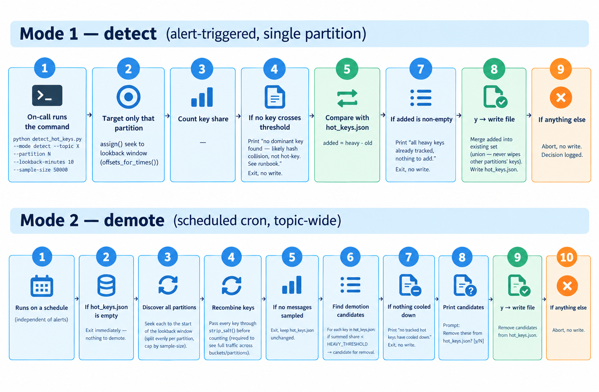

# Source Systems

## Table of Contents
- [Source Systems](#source-systems)
  - [Table of Contents](#table-of-contents)
  - [Transaction events producer (simulate payment gateway) and Identity risk producer](#transaction-events-producer-simulate-payment-gateway-and-identity-risk-producer)
    - [Configuration Choices](#configuration-choices)
    - [Partition count + local multi-broker simulation](#partition-count--local-multi-broker-simulation)
    - [Producer-Side Hot Key Reload](#producer-side-hot-key-reload)
  - [Data Restructuring: Transaction, User Reference, and Merchant Data](#data-restructuring-transaction-user-reference-and-merchant-data)
    - [Why We Split the Data](#why-we-split-the-data)
    - [Current Version: Keep It Simple](#current-version-keep-it-simple)
    - [Next Step: Orchestration and Real-Time Updates](#next-step-orchestration-and-real-time-updates)

## Transaction events producer (simulate payment gateway) and Identity risk producer

### Configuration Choices
**1. Linger.ms**\
We set `"linger.ms": 5` to allow a little batching, but not too much. This is a trade-off between latency and throughput.

Compared to a higher value like 20ms: more small packets, less compression benefit, higher CPU and network cost per message. But fraud detection needs fast detection. So we choose a low `linger.ms` (1-5ms). The overhead cost is small. It is worth it for fresh, real-time data.

**2. Prevents both duplicates and out-of-order messages.**\
`"enable.idempotence": True` because we cannot allow duplicate messages. This choice can increase latency: if a retry happens, the next events wait until that retry finishes. But this is good, because it keeps order correct. It prevents both duplicates and out-of-order messages. Idempotence forces `acks=all` (you need full replication confirmation for the guarantee to work) and requires `retries > 0` (idempotence exists to make retries safe).

`"acks": "all"` — the end-to-end latency stays the same, but the response time (how long `send()` takes to confirm) becomes longer. We use an asynchronous producer, so this is not a problem. The only limit: if there are 5 in-flight requests, the producer waits and sends no more until one of the 5 gets acknowledged (`"max.in.flight.requests.per.connection": 5`).

**3. Send pattern: async + callback**\
We send messages asynchronously with a callback pattern: `delivery_report()` logs errors when a send fails, `poll(0)` drains callbacks on every loop, and `flush(30)` waits for everything left in the buffer before the script ends.

**4. Timeouts**
$$\text{delivery.timeout.ms} \ge \text{request.timeout.ms} + \text{linger.ms}$$

- `request.timeout.ms = 30000` (30 sec — wait time for one single broker reply)
- `delivery.timeout.ms = 120000` (2 min — total budget, including all retries)
- `retries`: set to a high number. We let `delivery.timeout.ms` control when to stop, not the retry count itself.

**5. Compression**\
`compression.type = snappy` gives low CPU cost. A 5ms linger time is too short for a strong compression ratio, but snappy is still better than no compression at all.

**6. Headers**\
We add headers to each message to help with debugging and tracking: `source-service`, `run-id`, `schema-version`, and `event-time` (event-time comes from `current_dt` in the merged row). Headers allow fast message routing and filtering based on metadata, without extra CPU cost — a consumer can read the header directly, without deserializing the full message value.

### Partition count + local multi-broker simulation

Formula:

$$\text{partitions} = \max\left(\frac{\text{target throughput}}{\text{per partition producer throughput}}, \frac{\text{target throughput}}{\text{per partition consumer throughput}}\right)$$

 We need to avoid resharding in production, so we need to pick a partition count that is high enough to handle expected load see [Hot Key Risk and Data Skew — A. Partition Count](00_technical_challenges.md#our-solution). We pick 12 Partitions (Over-Provisioning Partitions) cheap now, expensive later

For local testing, Redpanda supports a 3-node cluster through docker-compose:
`KAFKA_BROKER = "redpanda-0:29092,redpanda-1:29093,redpanda-2:29094"`

> [!NOTE]
> Since transaction and identity events come from two separate producers, small delays (around 5ms) between them are fine — even good. They mimic real production behavior, and give the Flink job a real join problem to solve.


### Producer-Side Hot Key Reload

This section covers how producers pick up hot-key updates at runtime.
For the broader problem this solves — why hot keys occur, how they're
detected, and the decision to use salting over other approaches — see [Hot Key Risk and Data Skew](00_technical_challenges.md#1-hot-key-risk-and-data-skew).

**End-to-End Flow**



**What This Solves**

Once on-call confirms a hot key update via `detect_hot_keys.py`, the change is written to `hot_keys.json` on disk. Producers need to pick up this change **without a restart** and **without wastefully polling the disk** when nothing has changed.

**1. Salting logic — `build_key()`**

`hot_key_utils.py` exposes a single function every producer calls in place of using the raw key directly:

```python
def build_key(raw_key: str) -> str:
    if raw_key in _store.get():
        bucket = random.randint(0, SALT_BUCKETS - 1)
        return f"{raw_key}-{bucket}"
    return raw_key
```

If the raw key (`card1`) is **not** in the current hot-key set, it passes through unchanged — this is the common case, and it's what preserves per-card ordering for every normal card, which the downstream fraud sequence detection depends on. Only a key confirmed hot gets a `-{bucket}` suffix appended, where `bucket` is chosen uniformly at random from `0` to `SALT_BUCKETS - 1`. This spreads that one key's traffic across `SALT_BUCKETS` sub-partitions instead of one, at the cost of breaking that key's own ordering for the duration it stays salted.

**2. Reload strategy — event-driven, not blind polling**

`HotKeyStore` is held once in producer memory (RAM) and backs `build_key()`'s lookups. The reload is triggered by a file change, not a fixed timer:

1. Every `MTIME_CHECK_INTERVAL_SEC` (default 5s), the store checks the file's **modification time** via `os.path.getmtime()` — a cheap OS `stat` call that does not open or read the file.
2. If the mtime is unchanged since the last check, the store returns immediately. **No file read happens.**
3. Only when the mtime has actually changed (meaning `detect_hot_keys.py` wrote a confirmed update) does the store open the file and `json.load()` it into memory.

This means: no confirmed change on disk → stat only, ever, no read. A confirmed change (on-call approves via `detect_hot_keys.py`) → picked up within `MTIME_CHECK_INTERVAL_SEC`, no producer restart.

**3. Race-condition handling**

`detect_hot_keys.py` writes `hot_keys.json` with a plain `open(...).write()` — not atomic. If a producer's mtime check happens to land mid-write, `json.load()` can raise `json.JSONDecodeError` on a partially-written file. `HotKeyStore._reload()` catches this (and `OSError`) silently and keeps the previous in-memory key set until the next check succeeds:

```python
except (json.JSONDecodeError, OSError):
    pass  # mid-write, keep old set
```

This avoids needing file locking between the writer (`detect_hot_keys.py`, run manually and infrequently) and the readers (producers, checking every few seconds) — the cost of a missed read is just one extra `MTIME_CHECK_INTERVAL_SEC` of delay before the update lands, not a crash.

**4. Configuration**

| Env var | Default | Meaning |
|---|---|---|
| `HOT_KEYS_PATH` | `/app/data/hot_keys.json` | Must be the same path used by `detect_hot_keys.py` — a mismatch means the producer silently never sees updates. |
| `SALT_BUCKETS` | `4` | Number of sub-partitions a hot key is spread across once salted. |
| `MTIME_CHECK_INTERVAL_SEC` | `5` | How often the cheap `stat` check runs. Lower = faster pickup, more syscalls; higher = the reverse. 5s balances both without needing tuning. |


## Data Restructuring: Transaction, User Reference, and Merchant Data

### Why We Split the Data

The original dataset (`train_transaction.csv`) comes from Kaggle as one flat file. All transaction data, user information, and merchant information are mixed together in the same table.

This is not how a real production fraud detection system looks. In a real system (see [01_Problem_Definition](01_problem_definition.md#source-systems)), transaction events, user reference data, and merchant data come from **different source systems**:

- **Transaction events** come from the payment gateway, in real time.
- **User reference data** (card info, address, email) comes from a CRM system, updated daily.
- **Merchant data** (merchant risk score) comes from a merchant management system, also updated daily.

These systems are separate in real life. They have different owners, different update speeds, and different infrastructure. If we keep everything in one flat table, we lose this structure, and we cannot simulate the real architecture our project is built around (see [ADR-04](02_architecture.md#adr-04-why-using-broadcast-state-for-reference-data)).

So we split the flat Kaggle data into three parts, to simulate three separate source systems:

1. **`train_transaction_fact.csv`** — the transaction stream. Contains only fast-changing, per-event data (amount, product code, engineered V/C/D features, identity/device info).
2. **`user_reference.csv`** — a dimension table with slow-changing user/card attributes (card type, address, email domain).
3. **`merchant_data.csv`** — a dimension table with merchant risk information (fraud rate per product category).

Each transaction record has a foreign key (`user_reference_sk`, `merchant_data_sk`) pointing to the correct row in each dimension table. This is the same join pattern the real system will use: Flink reads the transaction stream and joins it with reference data through broadcast state, instead of one large merged table.

### Current Version: Keep It Simple

Right now, `user_reference.csv` and `merchant_data.csv` each store **only the latest known state** for every user (`card1`) or merchant category (`ProductCD`). There is no history and no versioning yet.

We chose this simple version first because:
- It is enough to build and test the first working pipeline end-to-end (data split → features → model → ONNX export).
- It avoids extra complexity before the rest of the system (Flink, Feast, broadcast state) is working.
- It matches the project's step-by-step approach: get something simple running correctly first, then improve it.

### Next Step: Orchestration and Real-Time Updates

Later, we will build a separate **orchestration process** that keeps `user_reference` and `merchant_data` up to date automatically, instead of computing them once from a static file.

This orchestration will:
- Detect real changes in the source data (for example, a card's address changes, or a merchant's fraud rate shifts).
- Update the reference tables to reflect the current state, similar in spirit to how [`detect_hot_keys.py`](00_technical_challenges.md#c-semi-automatic-flow) already updates `hot_keys.json` on a schedule.
- Keep each reference table close to real time, so that when a transaction arrives, Flink's broadcast state always reflects the most current known user and merchant state — not an outdated snapshot.

At that point, we will also add proper history tracking (SCD Type 2: `valid_from`, `valid_to`, `is_current`) so we can reconstruct what a user's or merchant's state was at any past point in time — useful for audit and for training data correctness. For now, we keep it simple: current state only, no history.